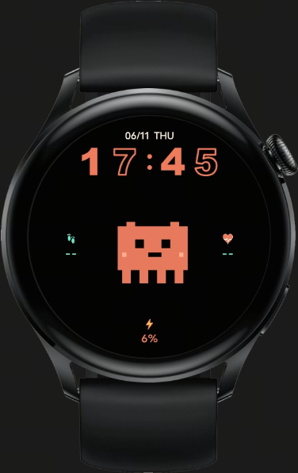
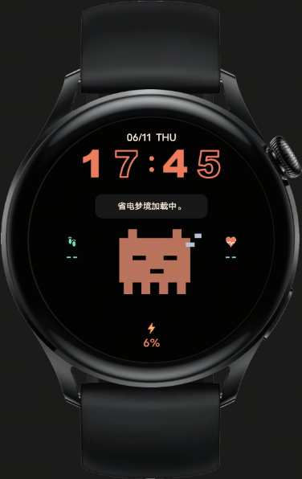
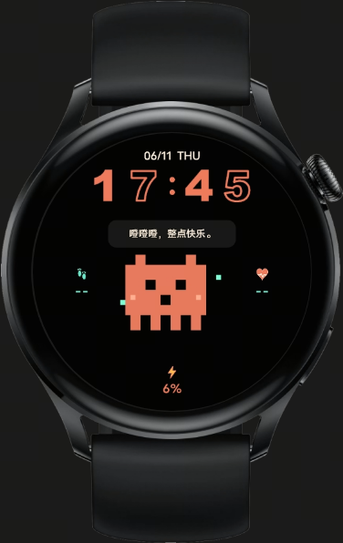
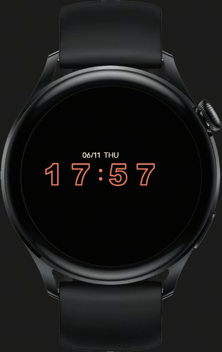
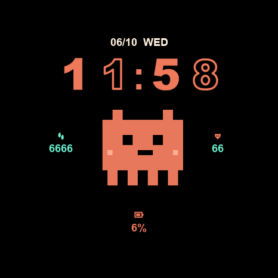

# 橙码码动态表盘

橙码码动态表盘是一个 vivo Watch / BlueOS 表盘工程，主角是一只橙色像素小宠物。表盘以黑底、橙色数字和轻量动效为核心视觉，亮屏时展示完整信息和宠物互动，息屏/AOD 时切换为低功耗的极简时间样式。

## 效果预览

图 1、图 2、图 3 为亮屏样式；图 4 为息屏/AOD 样式。

<table>
  <tr>
    <td align="center"><strong>图 1：亮屏待机</strong></td>
    <td align="center"><strong>图 2：亮屏互动</strong></td>
  </tr>
  <tr>
    <td></td>
    <td></td>
  </tr>
  <tr>
    <td align="center"><strong>图 3：亮屏互动</strong></td>
    <td align="center"><strong>图 4：息屏/AOD</strong></td>
  </tr>
  <tr>
    <td></td>
    <td></td>
  </tr>
</table>

项目内置预览图：



## 设计说明

- 亮屏样式：展示日期、时间、步数、心率、电量和中间的橙码码宠物。
- 息屏样式：隐藏宠物、健康数据和电量，只保留日期与空心数字时间，降低点亮面积。
- 时间数字：使用本地 PNG 数字资源拼接，亮屏采用“实心 + 空心”的视觉节奏，息屏统一为空心数字。
- 像素宠物：支持待机、跳舞、碎碎念、犯困、偷瞄、惊醒等帧动画。
- 互动气泡：点击宠物或自动触发互动时显示短句，例如“省电梦境加载中。”、“噔噔噔，整点快乐。”。
- 数据展示：通过 BlueOS 能力读取电量、步数和心率，未获取到数据时显示 `--`。

## 功能特性

- 动态时间与日期显示。
- 步数、心率、电量信息展示。
- 点击宠物触发随机动画和气泡文案。
- 自动待机动画，让表盘在亮屏状态下更有生命感。
- 亮屏/AOD 状态切换，息屏时进入简版低功耗布局。
- 支持圆形和方形手表设备类型。

## AOD 说明

BlueOS 表盘进入息屏/AOD 后，JS 可能会被系统冻结，因此项目不是单纯等待息屏事件后再切 UI，而是在系统自动熄屏前提前准备低功耗最后一帧：

1. 读取 `screen.getScreenOffTime()` 获取自动熄屏时间。
2. 在熄屏前短时间尝试切换到简版样式。
3. 切换前读取亮度，避免屏幕仍然亮着时误切到 AOD。
4. 收到亮屏事件、亮度恢复、`onShow()` 或用户点击后恢复完整亮屏表盘。

核心逻辑位于 `src/watch3001/index.ux` 的 `scheduleAmbientPrepare()`、`enterSleepMode()` 和 `enterActiveMode()`。

## 项目结构

```text
.
├── README.md
├── package.json
├── src
│   ├── app.ux
│   ├── manifest.json
│   └── watch3001
│       ├── edit.ux
│       ├── index.ux
│       └── assets
│           ├── 3001.png
│           ├── digit-outline-*.png
│           ├── digit-solid-*.png
│           ├── icon-battery.png
│           ├── icon-heart.png
│           ├── icon-steps.png
│           └── pet-*.png
└── tsconfig.json
```

## 关键文件

- `src/manifest.json`：表盘包名、能力声明、设备类型和预览图配置。
- `src/watch3001/index.ux`：表盘主界面、动画、数据读取和亮屏/AOD 切换逻辑。
- `src/watch3001/edit.ux`：表盘编辑页入口。
- `src/watch3001/assets/`：数字、宠物帧、健康图标和预览图资源。

## BlueOS 能力

当前表盘使用的主要能力：

```js
import battery from '@system.battery'
import health from '@blueos.health.health'
import screen from '@blueos.hardware.display.screen'
import brightness from '@blueos.hardware.display.brightness'
import eventManager from '@blueos.app.event.eventManager'
```

`manifest.json` 中需要保留电量、健康、屏幕、亮度和事件相关 feature，否则真机数据或 AOD 切换可能不可用。

## 构建

在项目根目录执行 BlueOS 打包命令，例如：

```powershell
node "C:\Users\Lenovo\AppData\Local\Programs\BlueOSStudio\resources\app\extensions\blueos-debugger\node_modules\blueos-pack\bin\index.js" build --force --device-type watch-round --copy-preview-image
```

构建产物会输出到 `dist/` 目录下对应设备类型的包目录中。

## 截图文件

README 预览图位于：

```text
docs/images/preview-light-1.png
docs/images/preview-light-2.png
docs/images/preview-light-3.png
docs/images/preview-aod.png
```

其中 `preview-light-1.png`、`preview-light-2.png`、`preview-light-3.png` 是亮屏样式，`preview-aod.png` 是息屏/AOD 样式。
